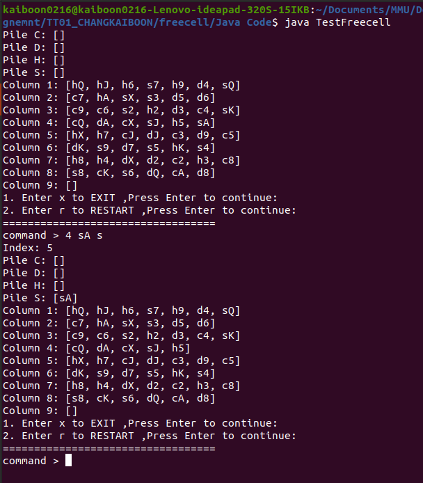

# Simple FreeCell
This game is a simplified version of FreeCell for university assignment.

The game supports the following 3 commands:
1. r - Restart a new game
2. x - Exit the game
3. source card destination - Move card from source Column to destination Coloum or Pile
4. For game rules, please refer to Rule/Rule.pdf

# How to start the game?
Clone this repo and run Java code/TestFreecell.java file on cmd/terminal

# Sample image of this game

